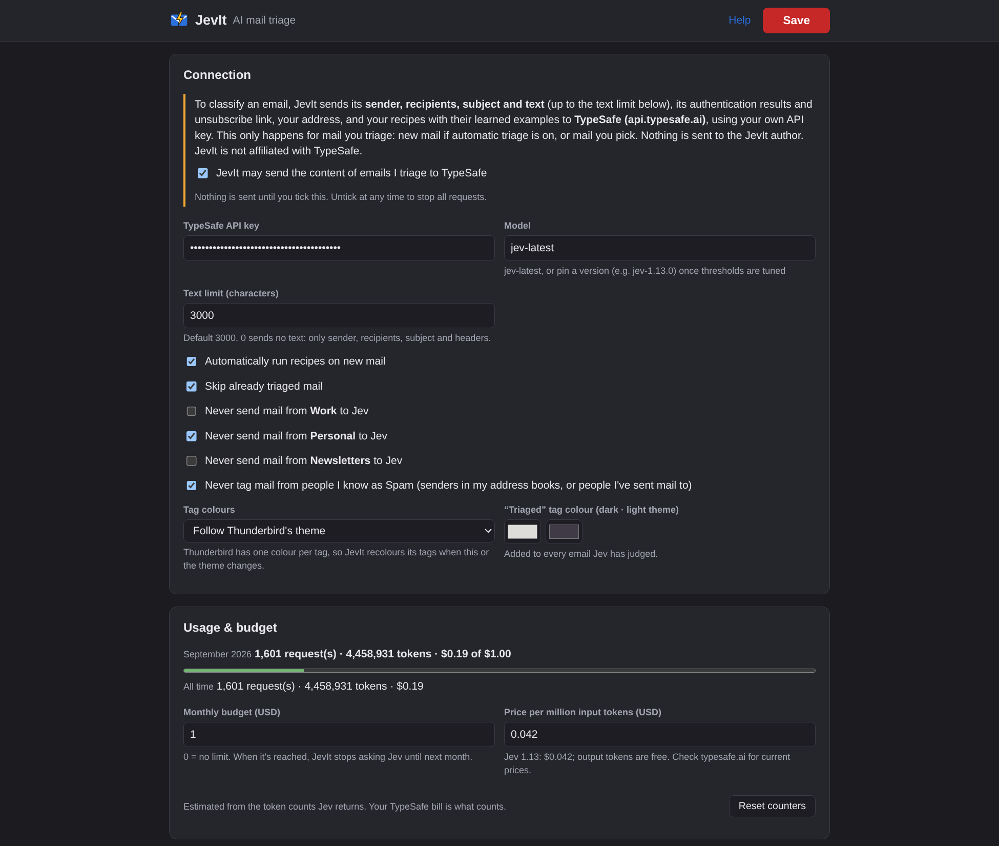
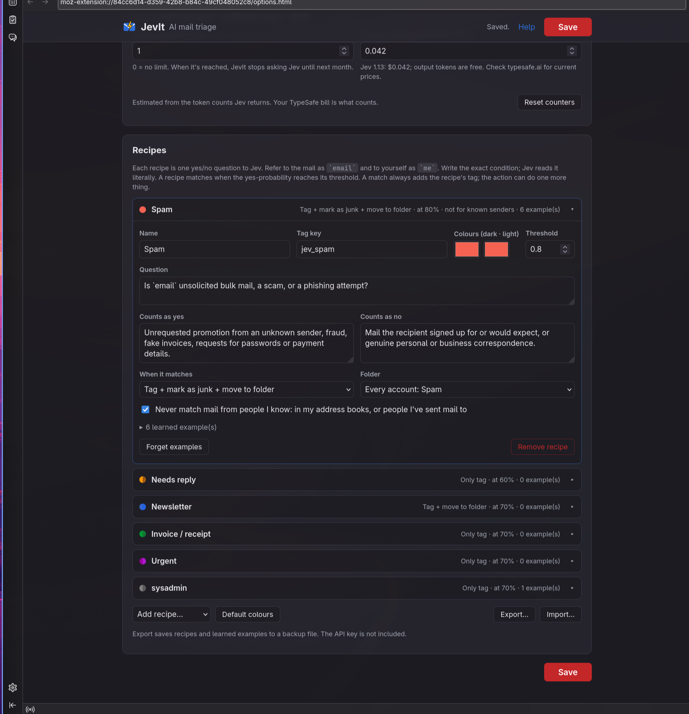

# JevIt: AI mail triage

A Thunderbird add-on that sorts your mail with **recipes**: plain-language yes/no questions ("Is this an invoice or receipt?") that TypeSafe's Jev model answers for each email. When a recipe's answer passes its threshold, JevIt tags the mail and can also star it, mark it read, mark it as junk, or move it to a folder.

Unofficial; not affiliated with TypeSafe.

| Connection, usage and budget | Recipes |
|---|---|
|  |  |

## Features

- Ready-made recipes: Spam, Needs reply, Newsletter, Invoice / receipt, Urgent, Meeting / event, Shipping, Security alert, Personal, Social, Jobs / recruiting.
- Write your own recipes, or create one from selected mail ("more like this").
- Teach Jev from your corrections: right-click → JevIt → "This is …" / "This is not …". Shortcuts: Alt+Shift+S (spam), Alt+Shift+D (not spam).
- See Jev's scores for the open email in the message-header popup, then correct and apply them.
- Triage selected mail from the context menu, or automatically for new mail. Already triaged mail is skipped by default.
- Progress on the toolbar button while triaging. Click the button to stop a long run.
- A Triaged tag on every mail Jev has judged, and tag colours for both light and dark themes.
- Move matches to one folder, or to a folder of the same name in each account (such as each account's own Junk).
- Mail from your contacts, or from people you've written to, is never tagged as Spam. This is checked locally.
- Exclude accounts: mail in them is never sent to Jev.
- Usage and a monthly budget (default $1) so costs stay in check.
- Export and import recipes as a JSON backup.

## Requirements

- Thunderbird 128 or newer
- A TypeSafe API key from https://typesafe.ai (usage is billed by TypeSafe)

Nothing is sent until you allow it in the JevIt manager. Mail content goes only to TypeSafe. See the privacy policy in [LISTING.md](LISTING.md).

## Development

There's no build step. To try it, go to Add-ons → gear → Debug Add-ons → Load Temporary Add-on and pick `manifest.json`.

```sh
node test.js      # logic tests; set TYPESAFE_API_KEY to also run the default recipes against Jev
zip jevit.xpi manifest.json LICENSE icon.svg jev.js background.js popup.* options.* help.html style.css
```

## License

[MPL-2.0](LICENSE)
